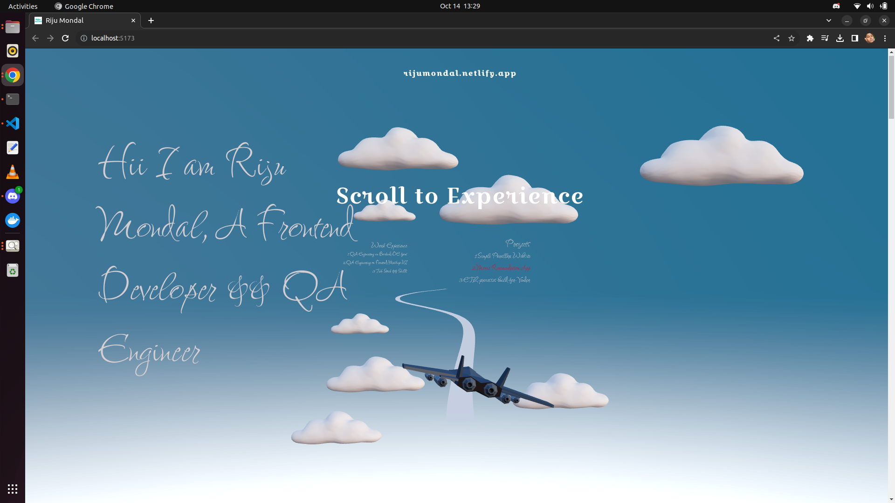

# My 3D Portfolio Site



Welcome to my 3D portfolio site, where I showcase my work and projects in an interactive and visually captivating manner. I've built this site with React Three Fiber (R3F) and Three.js, making it a powerful platform to display my 3D models and animations.

## Key Features

- **Interactive 3D Models**: I've designed the site to display my projects as interactive 3D models, allowing you to rotate and zoom for a closer look.

- **Project Gallery**: I've curated my work in a gallery format, complete with descriptions and links to detailed project pages.

- **Responsive Design**: This site adapts seamlessly to various screen sizes and devices, ensuring a consistent user experience.

- **Smooth Animations**: I've incorporated smooth animations to enhance your experience and bring my projects to life.


## Technologies Utilized

- [React](https://reactjs.org/): I've harnessed this JavaScript library to build the user interface.

- [React Three Fiber (R3F)](https://github.com/pmndrs/react-three-fiber): I've used R3F as the React reconciler for Three.js.

- [Three.js](https://threejs.org/): I've leveraged Three.js, a JavaScript 3D library, to create stunning 3D graphics.

- [react-drei](https://www.npmjs.com/package/@react-three/drei): I've also added the react-drei package to enhance my 3D components.

## Installation

1. Clone this repository to your local machine:

   ```bash
   git clone https://github.com/rijuoddusual1999/rijumondal.tech
   ```

2. Navigate to project directory:

    ```bash
    cd rijumondal.netlify.app
    ```

3. Install the required dependencies:

    
    ```bash
    npm install
    ```

4. Start the local hosting:

   
    ```bash
    npm run dev 
    ```
    